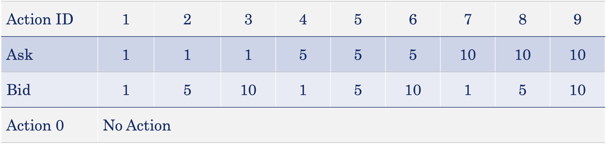
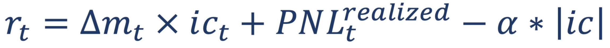
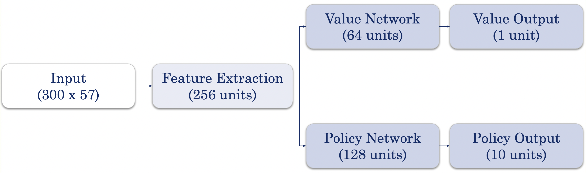
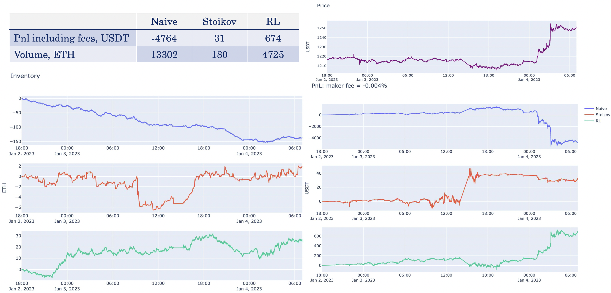
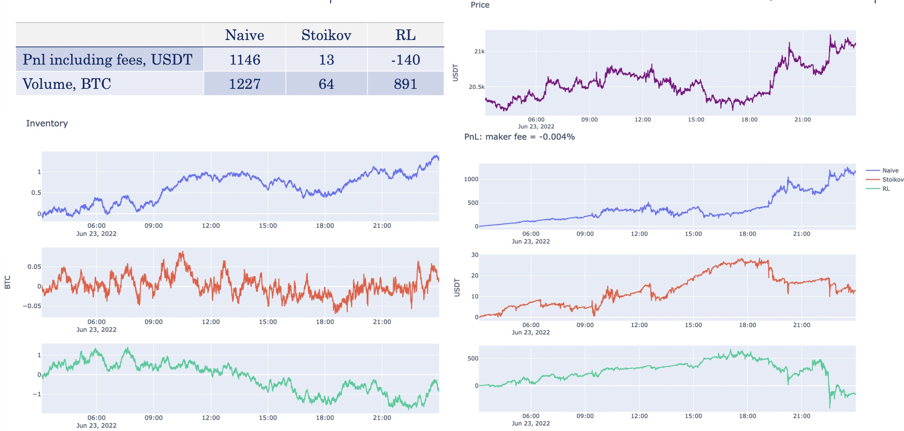

# Reinforcement Learning in Market Making

This project focuses on utilizing reinforcement learning techniques to develop market-making strategies.

## Overview

- Created a trading simulator that includes execution and market data latencies, providing a more realistic testing environment for various market making strategies.
- Implemented the Avellaneda-Stoikov strategy as a baseline for comparison and designed a deep reinforcement learning strategy using the Actor-Critic (A2C) algorithm.
- Conducted extensive experiments on high-frequency data to demonstrate the effectiveness of the reinforcement learning approach, while also identifying its limitations.

## Baselines

- Naive Strategy: At each time step, place buy and sell orders at the best available price level.
- Avellaneda-Stoikov Strategy ([paper link](https://math.nyu.edu/~avellane/HighFrequencyTrading.pdf))

## RL Strategy

### Environment State Space

- Price Level Distance to Midpoint
- Cumulative Notional Value at Price Level
- Notional Imbalances
- Order Flow Imbalance
- Custom RSI
- Spread

### Agent State Space

- Inventory Ratio
- Total PnL

### Action State Space

### Reward Function and Training Method

- Positional PnL with inventory penalty 
- Advantage Actor-Critic (A2C). The A2C update is calculated as 

### Function Approximator

## Experiments

### Environment

- Execution Latency: 10ms
- Market Data Latency: 10ms
- Maker Fee: -0.004%
- All orders are Post-Only type

### Methodology

- Data:
  - BTC/USDT: HFT data for June 23, 2022 (approximately 2.5 million snapshots)
  - ETH/USDT: HFT data from January 2, 2023, to January 4, 2023 (approximately 1.3 million snapshots)
- Train-Test Split:
  - BTC/USDT: Train - first three hours of data, Test - remaining 21 hours
  - ETH/USDT: Train - first six hours of data, Test - remaining 1 day and 13 hours

### Results

- BTC: 
- ETH: 

## Conclusions

- Developed a reinforcement learning-based strategy for market making.
- Evaluated the effectiveness of the strategy on real-world data compared to two classical approaches: naive strategy and Avellaneda-Stoikov strategy.
- Limitations of the RL approach include the need for algorithm training, which requires significant time and computational resources, a large number of hyperparameters that impact the final results and need to be tuned, and the inference speed of the RL strategy.
